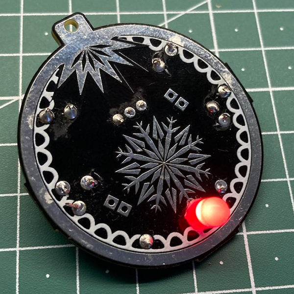
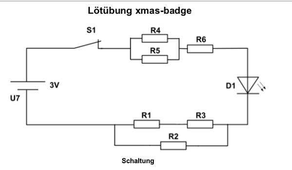

  |[:skull:ISSUE](https://github.com/frankyhub/KiCad-Loetuebung-xmas/issues?q=is%3Aissue)|[:speech_balloon: Forum /Discussion](https://github.com/frankyhub/KiCad-Loetuebung-xmas/discussions)|[:grey_question:WiKi](https://github.com/frankyhub/KiCad-Loetuebung-xmas/wiki)|
|--|--|--|
| | | |
||||
||  last 14days| |

# Loetuebung xmas

[Alexander Kutschera](https://github.com/vektorious/ "Alexander Kutschera") und ich haben diese Leiterplatte im Rahmen eines Bildungsworkshops über Elektronik verwendet. Die Anleitungen und Übungen für die Schülerinnen und Schüler befinden sich im Ordner edu. 

## Aufgaben

1. Bestücke den Batteriehalter, den Schalter S1 und die rote LED D1.
2. Überbrücke R2.
4. Bei einer Batteriespannung von 3V soll der LED-Strom 30mA betragen. Berechne den Wert für R6.
5. Löte R6 ein.
6. Schließe einen Strommesser anstelle von R4 an und überprüfe den LED-Strom.
7. Trenne die Brücke von R2 auf und bestimme den Widerstand R2 bei einen LED-Strom von 12mA.
8. Löte R2 ein.
9. Überprüfe den Gesamtstrom.
10. Überbrücke R3.
11. Durch R1 soll der LED-Strom auf 15mA steigen. Welchen Wert hat R1?
12. Löte R1 ein und überprüfe den LED-Strom.
13. Entferne die Brücke bei R3.
14. Der Gesamtstrom soll sich durch R3 auf 13mA ändern. Welchen Wert hat R3?
15. Entferne den Strommesser bei R4.
16. Der Gesamtstrom soll sich durch die Bestückung von R4 und R5 auf 10mA ändern.

Welchen Wert hat R4 und R5?

---

Die Platinen wurden von [PCBWay](https://www.pcbway.com/) gesponsert. 

---

   
<ol class="breadcrumb" style="border-top: 2px solid black;border-bottom:2px solid black; height: 45px; width: 900px;"> 
<a href="#oben">nach oben</a>
</ol>

  

---

